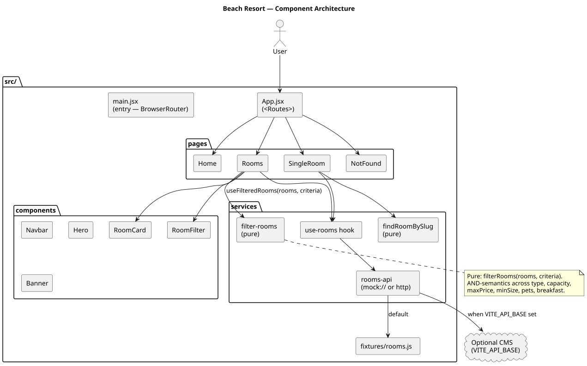
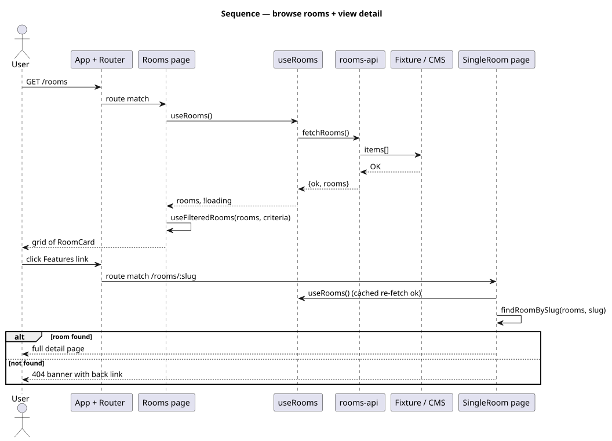
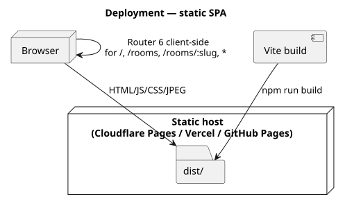

# Beach Resort

Single-page rooms catalogue + booking-funnel front-end for a beach resort.
React 18 + Vite + React Router 6, with a pure filter pipeline you can unit
test in isolation.

[](https://github.com/tzone85/react-beach-resort/actions/workflows/ci.yml)


Originally a React 16 + react-scripts 3 + react-router-dom 5 scaffold where
`SingleRoom.js` was a literal placeholder (`<div>Hello from Single Room Page</div>`)
and `Rooms.js` never rendered the rooms it had data for. This rewrite builds
both pages out, modernizes the stack, and adds real tests + CI.

## Bugs / smells fixed during the port

| File / area (original)                | Issue                                                                                              |
|---------------------------------------|----------------------------------------------------------------------------------------------------|
| `src/pages/SingleRoom.js`             | Placeholder — `<div>Hello from Single Room Page</div>`. Replaced with full detail page driven by `useParams` + `findRoomBySlug`. |
| `src/pages/Rooms.js`                  | Showed only the hero banner; no room cards. Replaced with grid + `RoomFilter`. |
| `src/components/Navbar.js`            | Class component + `this.setState`; toggle button without `aria-expanded`. Functional + accessible. |
| `react-router-dom@5`                  | Migrated to v6: `<Switch>` → `<Routes>`, `component=` → `element=`, splat route via `path="*"`. |
| `vite.config.js` `base: "./"` (would-be regression) | After porting to Vite, relative base broke direct navigation to `/rooms/:slug` — `./assets/x.js` resolved against `/rooms/foo/` → 404 → React Router never boots. Documented in the config; absolute `base: "/"` is correct for SPA deep-links. |
| `src/data.js` (760 lines)             | All-inline data with image imports. Moved to `src/fixtures/rooms.js` behind a `useRooms` hook; production swap is a single env var. |

## Architecture

### Components



### Browse + view sequence



### Deployment



Diagrams are PlantUML under `docs/architecture/*.puml`; rendered SVGs are
checked in. Regenerate with `./scripts/render_diagrams.sh`.

## Quick start

```bash
npm install
npm run dev          # vite dev server on :5173
npm run build        # dist/
npm run preview      # serves dist/ on :4173
npm test             # vitest + coverage (80% gate)
npm run test:e2e     # playwright vs preview
npm run lint
```

Pointing at a real backend:

```bash
VITE_API_BASE=https://your-cms npm run dev
# expects GET ${VITE_API_BASE}/rooms → Room[]
```

## Project layout

```
src/
├── main.jsx                  # entry — BrowserRouter wraps App
├── App.jsx                   # <Routes> /, /rooms, /rooms/:slug, *
├── pages/
│   ├── Home.jsx
│   ├── Rooms.jsx             # list with filter
│   ├── SingleRoom.jsx        # detail by slug, 404 banner if missing
│   └── NotFound.jsx
├── components/
│   ├── Navbar.jsx            # functional, aria-expanded toggle
│   ├── Hero.jsx
│   ├── Banner.jsx
│   ├── RoomCard.jsx
│   └── RoomFilter.jsx
├── services/
│   ├── rooms-api.js          # mock:// (default) | https://CMS
│   ├── use-rooms.js          # useRooms + useFilteredRooms + findRoomBySlug
│   └── filter-rooms.js       # PURE: filter by type/cap/price/size/pets/breakfast
├── fixtures/rooms.js
└── styles/main.css
public/images/                # 18 jpg/svg assets, served verbatim
tests/
├── unit/                     # vitest + happy-dom + RTL
└── e2e/site.spec.js          # playwright chromium
docs/architecture/            # PlantUML + SVGs
.github/workflows/ci.yml
```

## Tests

| Suite                              | Count   | What                                                                |
|------------------------------------|---------|---------------------------------------------------------------------|
| `tests/unit/filter-rooms.test.js`  | 9       | type / capacity / price / size / pets / breakfast / AND-combined / empty |
| `tests/unit/rooms-api.test.js`     | 5       | mock fallback, real fetch, 4xx / transport / non-array              |
| `tests/unit/use-rooms.test.jsx`    | 4       | hook loading/success/error + findRoomBySlug                         |
| `tests/unit/RoomCard.test.jsx`     | 1       | Renders name, price, alt, slug link                                 |
| `tests/unit/Navbar.test.jsx`       | 2       | Toggle aria-expanded + home/rooms links                             |
| `tests/e2e/site.spec.js`           | 4       | Home→Rooms→Single, 404 deep link, filter narrows, empty-state       |
| **Total**                          | **25**  | 80% line / 75% branch gate on `src/services/**` + `src/components/RoomCard` + `src/components/Navbar` |

## CI

Lint → unit + coverage → Playwright e2e → Vite build. Playwright artifacts uploaded for 14 days.

## License

MIT — see [LICENSE](LICENSE).
